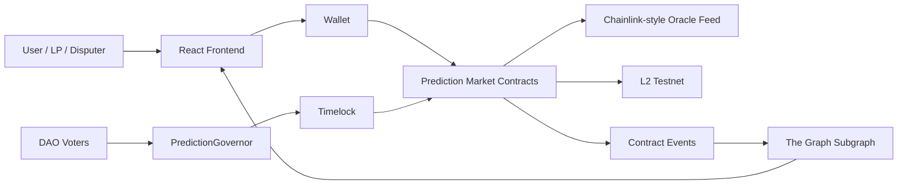
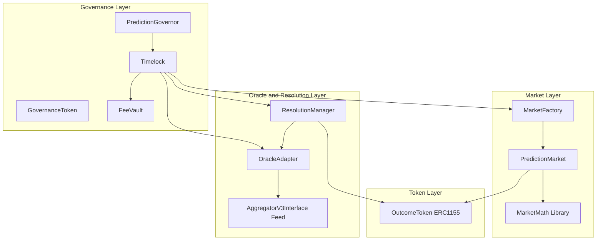
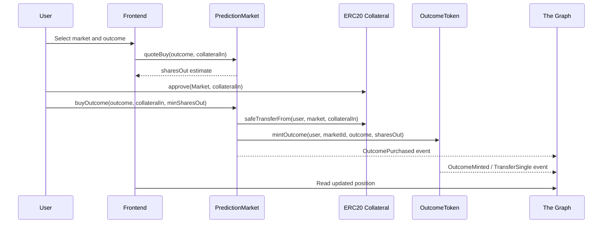
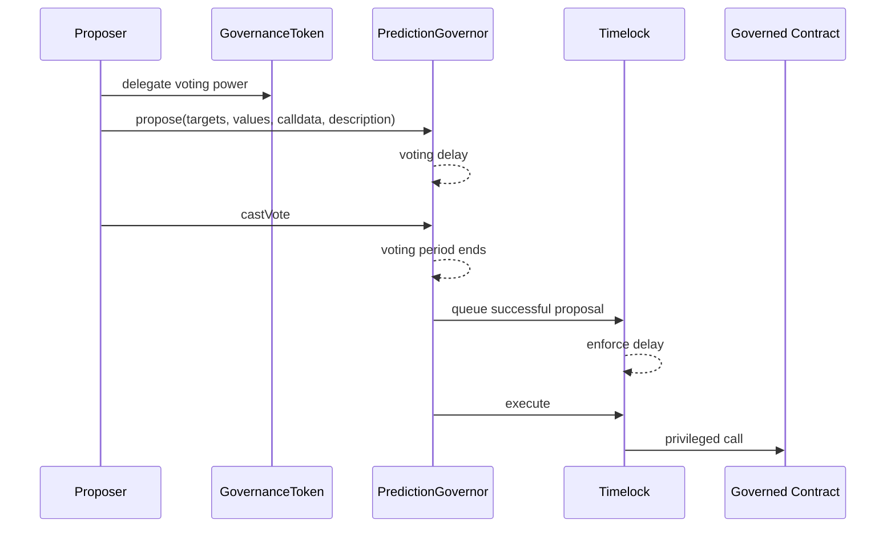
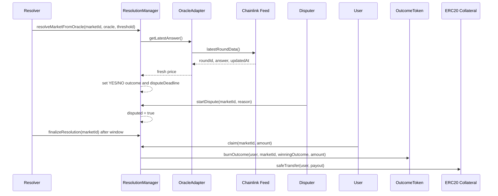
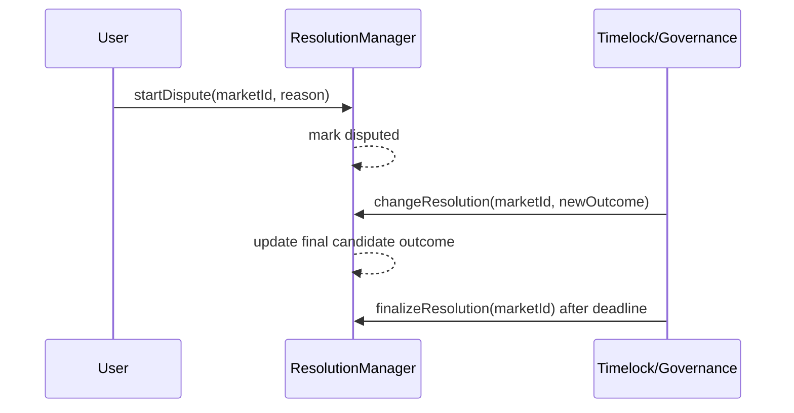

# Architecture

## System Overview

The project is an on-chain binary prediction market for the Blockchain Technologies 2 final project. Users create or join markets with two outcomes: YES and NO. They buy outcome shares through an automated market maker, wait for the market close time, then rely on oracle-backed or governance-backed resolution. After the dispute window ends, winning outcome holders can claim collateral.

The main product goal is to demonstrate a complete decentralized market lifecycle:

- market creation and trading,
- ERC-1155 outcome share accounting,
- automated market maker pricing,
- oracle freshness checks,
- dispute and finalization flow,
- DAO-governed privileged actions,
- indexable events for frontend and The Graph.

The core entities are:

| Entity | Purpose |
|---|---|
| User | Buys YES/NO shares, provides liquidity, disputes resolutions, claims payouts. |
| Frontend | React/Viem/Wagmi interface for market interaction. |
| PredictionMarket | Holds market metadata, liquidity, CPMM reserves, fees, and buy flow. |
| MarketFactory | Creates markets and grants required permissions. |
| OutcomeToken | ERC-1155 token contract for YES/NO outcome shares. |
| OracleAdapter | Chainlink-style adapter that rejects stale or invalid oracle answers. |
| ResolutionManager | Stores close time, resolution state, disputes, finalization, and claiming placeholder flow. |
| GovernanceToken | Voting token used for DAO governance. |
| PredictionGovernor | OpenZeppelin Governor contract for proposals and voting. |
| Timelock | Delays privileged execution and owns sensitive roles. |
| FeeVault | Collects protocol fees and can be governed or upgraded depending on final design. |
| The Graph | Indexes market, trade, resolution, and claim events. |
| L2 Testnet | Target deployment environment, such as Base Sepolia or Arbitrum Sepolia. |

## C4 Level 1: System Context

The system is designed around users interacting through a frontend. The frontend talks to deployed smart contracts on an L2 testnet. Contracts emit events that The Graph indexes for fast reads. Oracle resolution reads from a Chainlink-style feed through `OracleAdapter`.



System context responsibilities:

| Actor/System | Interaction |
|---|---|
| User | Calls `addLiquidity`, `buyOutcome`, `startDispute`, and `claim`. |
| DAO voter | Creates and votes on proposals. |
| Frontend | Encodes contract calls and displays indexed state. |
| Wallet | Signs transactions and messages. |
| Contracts | Enforce pricing, token balances, roles, resolution, and payout rules. |
| Chainlink-style oracle | Provides external price data with `latestRoundData`. |
| The Graph | Builds read models for market lists, user positions, and resolution status. |
| L2 testnet | Provides lower-cost execution for trading and governance actions. |

## C4 Level 2: Container and Component View

The smart contract system is split into modules so each teammate can work independently and later integrate through minimal interfaces.



Component responsibilities:

| Component | Responsibility | Key Risks |
|---|---|---|
| MarketFactory | Creates markets and wires roles. | Wrong role grants, duplicate markets. |
| PredictionMarket | Handles liquidity, CPMM reserves, share purchases, fees. | Pricing bugs, slippage bypass, reserve accounting errors. |
| MarketMath | Pure math for fee and buy quote calculations. | Rounding, invariant mistakes. |
| OutcomeToken | ERC-1155 YES/NO token IDs and role-protected mint/burn. | Unauthorized minting, wrong token ID formula. |
| OracleAdapter | Reads oracle price and enforces freshness. | Stale price, invalid answer, wrong feed. |
| ResolutionManager | Resolves, disputes, finalizes, and supports claiming flow. | Unauthorized resolution, premature claims, reentrancy. |
| GovernanceToken | Voting power. | Vote concentration, delegation assumptions. |
| PredictionGovernor | Proposal lifecycle. | Unsafe proposal execution if timelock is bypassed. |
| Timelock | Delayed execution for privileged operations. | Admin compromise or delay misconfiguration. |
| FeeVault | Fee custody and distribution. | Upgrade/storage risk, unsafe withdrawals. |

## Sequence Diagrams

### Buy Outcome Shares



### Governance Proposal Lifecycle



### Market Resolution Flow



### Dispute Override Flow



## Data Model and Storage Layout

### PredictionMarket

| Variable | Type | Purpose |
|---|---|---|
| `collateralToken` | `IERC20 immutable` | ERC20 used to buy shares and provide liquidity. |
| `outcomeToken` | `IOutcomeToken immutable` | ERC-1155 outcome token dependency. |
| `marketId` | `bytes32 immutable` | Unique market identifier shared across modules. |
| `question` | `string` | Human-readable market question. |
| `closeTime` | `uint256` | Time after which buying is disabled. |
| `feeBps` | `uint256` | Trading fee in basis points. |
| `yesReserve` | `uint256` | Virtual YES reserve for CPMM pricing. |
| `noReserve` | `uint256` | Virtual NO reserve for CPMM pricing. |
| `totalLiquidity` | `uint256` | Total liquidity accounting units. |
| `collectedFees` | `uint256` | Fees collected from trades. |
| `liquidityBalanceOf` | `mapping(address => uint256)` | Liquidity provider balances. |

### OutcomeToken

| Variable | Type | Purpose |
|---|---|---|
| `MINTER_ROLE` | `bytes32 constant` | Role allowed to mint outcome shares. |
| `BURNER_ROLE` | `bytes32 constant` | Role allowed to burn outcome shares. |
| ERC-1155 balances | inherited mapping | Tracks balances by `(holder, tokenId)`. |

Outcome token IDs are deterministic:

```solidity
uint256(keccak256(abi.encode(marketId, outcome)))
```

### OracleAdapter

| Variable | Type | Purpose |
|---|---|---|
| `feed` | `AggregatorV3Interface` | Chainlink-style source of price data. |
| `stalePeriod` | `uint256` | Maximum accepted age of oracle answer. |
| `owner` | inherited Ownable | Account allowed to update feed and stale period. |

### ResolutionManager

| Variable | Type | Purpose |
|---|---|---|
| `outcomeToken` | `IOutcomeToken immutable` | ERC-1155 token burned during claims. |
| `disputeWindow` | `uint256 immutable` | Required time between resolution and finalization. |
| `resolutions` | `mapping(bytes32 => Resolution)` | Resolution state by market. |

`Resolution` layout:

| Field | Type | Purpose |
|---|---|---|
| `closeTime` | `uint256` | Market close time copied from market setup. |
| `disputeDeadline` | `uint256` | Timestamp after which finalization is allowed. |
| `payoutPerShare` | `uint256` | ERC20 payout amount scaled by `1e18`. |
| `collateralToken` | `address` | ERC20 token used for payouts. |
| `outcome` | `uint8` | `0` unresolved, `1` YES, `2` NO, `3` cancelled. |
| `resolved` | `bool` | Whether an initial resolution exists. |
| `disputed` | `bool` | Whether a dispute was opened. |
| `finalized` | `bool` | Whether claims are allowed. |
| `cancelled` | `bool` | Whether the market was marked invalid. |

### Upgradeable FeeVault Storage

If `FeeVault` is implemented as upgradeable, storage must be append-only. A safe initial layout would be:

| Slot Order | Variable | Type | Notes |
|---|---|---|---|
| 1 | `collateralToken` | `IERC20` | Fee token. |
| 2 | `treasury` | `address` | Fee recipient. |
| 3 | `totalFeesReceived` | `uint256` | Accounting counter. |
| 4 | `paused` | `bool` | Emergency pause flag. |
| 5 | `__gap` | `uint256[46]` | Reserved slots for future upgrades. |

Upgradeable storage rules:

- never reorder existing variables,
- never change an existing variable type,
- only append new variables before the gap,
- reduce the gap size when adding variables,
- keep upgrade authority behind Timelock/Governance.

## Trust Assumptions

| Assumption | Explanation | Failure Mode |
|---|---|---|
| Timelock controls privileged roles | Admin roles should move from deployer to Timelock before production use. | Deployer compromise can change feeds, roles, fees, or resolution permissions. |
| Oracle feed is honest enough and monitored | `OracleAdapter` rejects stale and invalid answers, but cannot prove the real-world event itself. | Valid but manipulated oracle answer can resolve incorrectly. |
| Dispute window is long enough | Users need time to observe resolution and dispute bad outcomes. | Too-short window allows bad resolution to finalize before review. |
| Market IDs are unique | MarketFactory should prevent accidental or malicious duplicate market IDs. | Shared token IDs and resolution records can collide. |
| Collateral pool is funded before claims | `ResolutionManager` checks liquidity, but integration must fund the payout pool. | Winners cannot claim until enough collateral is deposited or claiming is moved to `PredictionMarket`. |
| Frontend reads indexed and on-chain state carefully | The Graph improves UX but chain state remains the source of truth. | Stale frontend index may show outdated resolution or balances. |

Remaining centralization:

- privileged roles exist during development,
- manual resolution exists for governance/dispute cases,
- oracle feed selection is governed,
- fee configuration is controlled by owner/governance,
- upgradeable vault designs require upgrade admin trust.

## Architecture Decision Records

### ADR-001: ERC-1155 for Outcome Shares

Decision: Use ERC-1155 for YES/NO outcome shares.

Reasoning:

- one contract can represent all markets and both outcomes,
- deterministic token IDs make indexing simpler,
- ERC-1155 batch support is useful for future UX,
- The Graph can track `TransferSingle` and custom outcome events.

Tradeoff:

- integrations must handle ERC-1155 rather than ERC-20 shares,
- token ID correctness is critical.

### ADR-002: CPMM Pricing for Market Purchases

Decision: Use CPMM-style reserve pricing for YES/NO shares.

Reasoning:

- deterministic pricing is easier to test,
- liquidity and price impact are transparent,
- quote and buy functions can share a pure math library.

Tradeoff:

- reserve design is simplified for a course project,
- sophisticated prediction-market mechanisms are out of scope.

### ADR-003: OracleAdapter Instead of Direct Feed Reads Everywhere

Decision: Centralize oracle freshness checks in `OracleAdapter`.

Reasoning:

- stale checks are easy to forget if each contract reads the feed directly,
- tests can target one adapter,
- `ResolutionManager` can call a stable `IOracleAdapter` interface.

Tradeoff:

- adapter owner/governance must configure the correct feed and stale period.

### ADR-004: Timelock for Privileged Operations

Decision: Production privileged roles should be owned by Timelock/Governance.

Reasoning:

- users get advance notice before sensitive changes execute,
- role changes and oracle feed changes are auditable,
- governance actions follow the same proposal lifecycle.

Tradeoff:

- emergency response is slower unless a separate emergency role is designed.

### ADR-005: ResolutionManager Claiming as Integration Placeholder

Decision: Keep claim logic in `ResolutionManager` for isolated testing, while documenting integration alternatives with `PredictionMarket`.

Reasoning:

- security tests can cover burning, payout, and reentrancy now,
- teammate modules can integrate later through clear modes,
- final architecture can either fund `ResolutionManager` or move payout execution into `PredictionMarket`.

Tradeoff:

- collateral ownership must be reconciled during integration.

